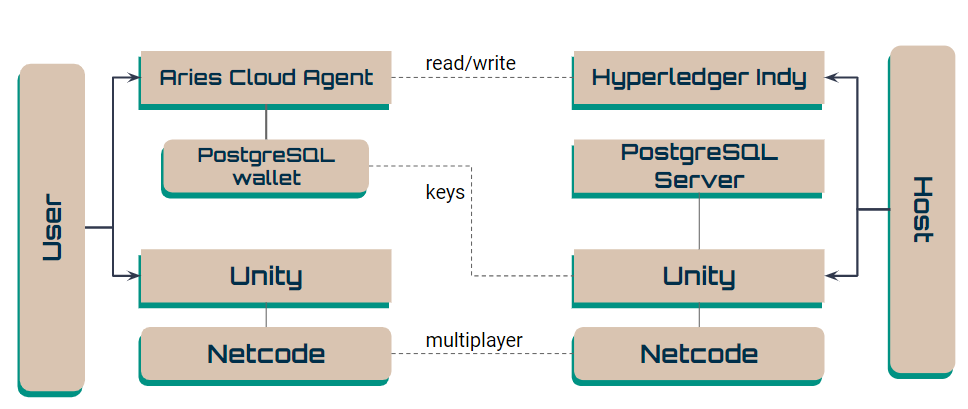
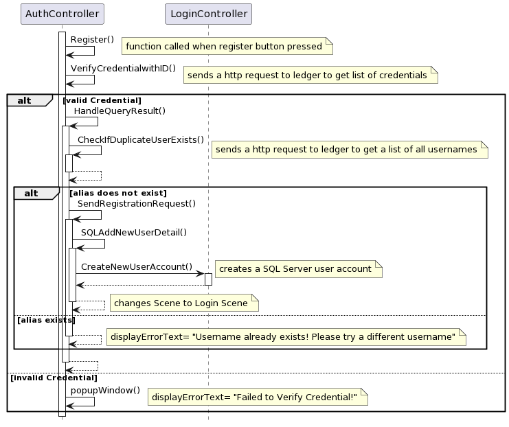
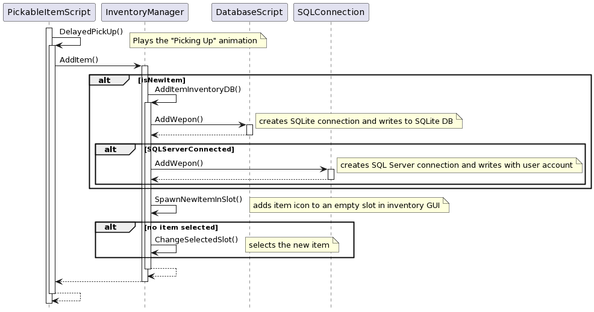
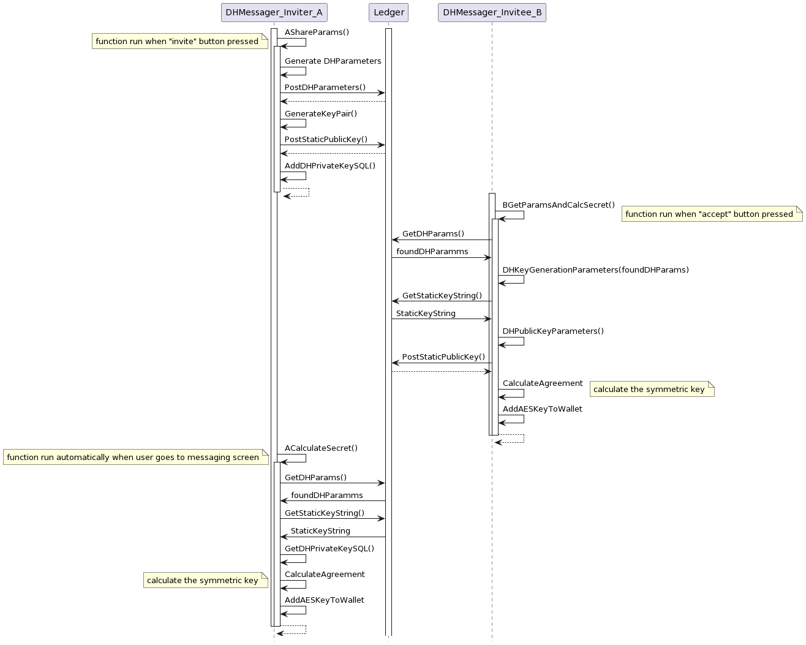
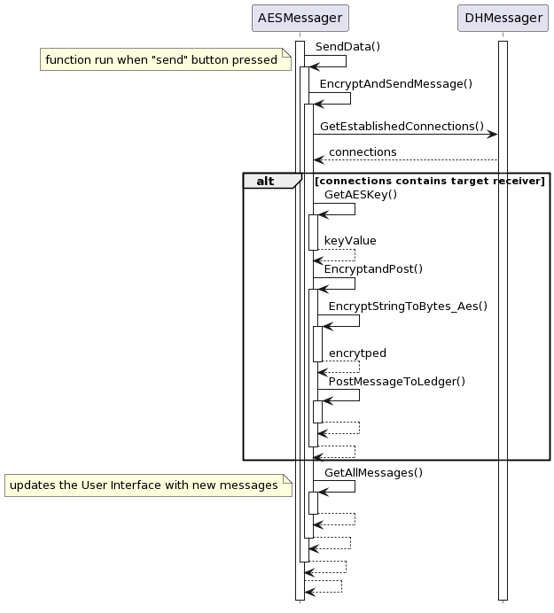
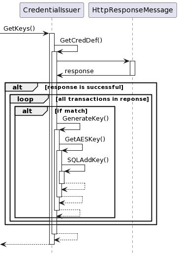
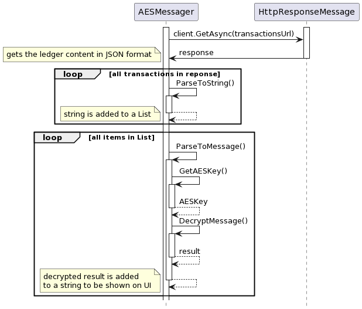
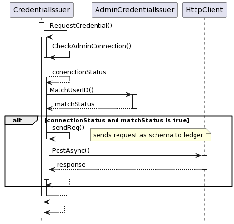
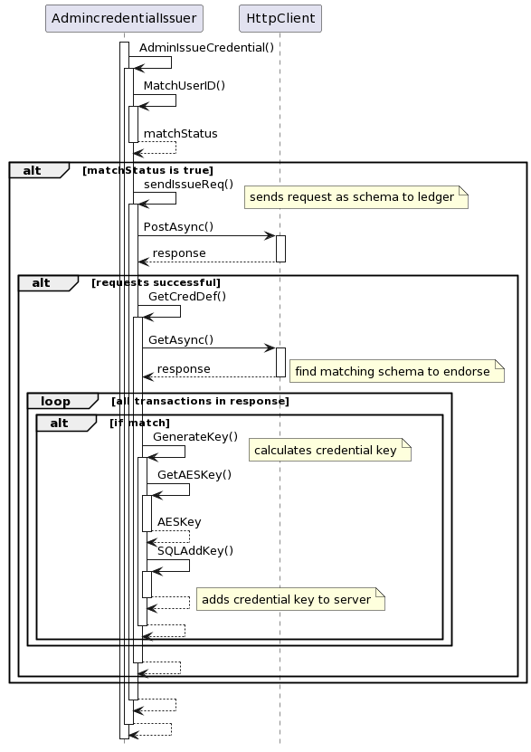

# Avatar Project Developer Guide

last update: 11/12/2023
you may refer to the web version for the latest version here: [https://quill-carriage-fc8.notion.site/Avatar-Project-User-Guide-e447ae230f014a388db5f3e380e92dc8?pvs=4](https://www.notion.so/Avatar-Project-Documentation-Landing-Page-a874edfbfab340b4a88817786147023a?pvs=21)

# Introduction

Avatar Project is a research-based project based on the Unity engine that seeks to find possible tech stacks and unity features that can be implemented for future use in other Unity projects. It is a 3D virtual world that uses keyboard and mouse as the main Man-Machine Interface, but can potentially be expanded into other forms of interfaces such as VR headsets.

The current tech stack includes:

1. Front end
    1. Unity Engine
2. Back end
    1. On Docker:
        1. Von-network: a local blockchain network used to store public information such as the usernames to ensure security
        2. SQL Server: used to store more sensitive private information such as passwords, issued credentials, as well as to ensure persistence in the player location and inventory items
        3. Aries Cloud Agent: a verifiable credential system but it has not been incorporated yet into the project due to its complexity and its reliance on internet connection
    2. SQlite database: a back up local database for users in case SQL servers are not connected or for offline use of the game. It stores less sensitive information, namely the player location and inventory items
    3. Netcode (integrated into Unity engine): Unity engine plugin package that allows for multi-player feature for the game

# Setting up the project

Please refer to our [User Guide](https://www.notion.so/Avatar-Project-User-Guide-e447ae230f014a388db5f3e380e92dc8?pvs=21) for instructions on setting up the project on your local machine.

# Design

### General Overview:

Below is an **architectural diagram** that describes the overview of how the application works.

This is the **network diagram** of the project. 

Refer to the sharing slides for more information and idea behind the project architecture.

### Tech Stack Important notes:

1. **Von network (a portable version of Hyperledger Indy)** uses **port 9000**, it has a built-in UI that can be accessed from the local host. This UI allows you to read the blockchain ledger.

To read the ledger, click on “Domain” under Ledger state, as shown below.

1. **Aca-py** uses **port 11001**. It has a built in Swagger Ui that shows all the possible functions used in the Verifiable Credentials framework. **Most functions/features built make HTML requests to this swagger interface to write schemas to the ledger**. This is done so that the Aries source code does not need to be edited and makes installation easier. You can refer to their repository readme to learn more. It can only be accessed with a valid login:
    
    
    
    It is important to note that schemas cannot have duplicate names. There can have multiple schema versions, the table below shows what each version is used currently and what group of features it corresponds to:
    
    note that currently the usernames are not hashed for demo purposes
    
    
    
2. PostgreSQL uses **port 5433 for the host database server**. Also, port 5432 is used for the Aca-py wallet. You can access the server and make queries through an app such as ****PGAdmin 4.****

# Sequence Diagrams

### 1. Creating an account with Von-network

In order for a successful account registration to be made, there needs to be a connection to both the Von-network and SQL server, both of which are mounted as docker containers on the host computer. 

The user will also have to have 5 valid inputs:
1. IP address of the host
2. Credential Code (similar to a invitation code)
3. Identity Code: a unique identifier 
4. User name
5. Password
6. Role: the role of this user on the Von-network ledger

Upon pressing the Registration button, the Credential Code will first be verified against the ledger with the use of the Identity Code. This is done by the `VerifyCrentialwithID` method. This method makes a http request to the Von-network ledger and a Json Array of items is returned by the ledger. The users credential code will be linearly checked against the ledger responses, and in order for the credential to be valid, the following checks are done:

1.  The credential has not expired
2.  The hashed value of the Identity Code input by the new user matches the identity code embedded within the credential that has a matching credential code that matches the user’s input

Once the credential has been validated, the `CheckIfDuplicateUserExists` method checks if the new user’s username input is unused. This is done by writing a http request to the von-network ledger that returns a string of all the existing usernames on the ledger in a Json format. The `CheckIfDuplicateUserExists` function linearly checks if there is an existing username that matches the user’s input username.

If the new requested username does not exist, the new registered account is written to the Von-network blockchain ledger through the `SendRegistrationRequest` method. This method uses a “Post” web request to the von-network ledger to write the new user name to the ledger.

Once this Post web request is successful, the `SQLAddNewUserDetail`
methods writes to the `userdata` table in `Avatar Project` database on the SQL Server. The username and password are hashed. The `LoginController` object is referenced and the `CreateNewUserAccount` method is called to create a new SQL Server user account using the same username and password. 

Following this, the Login scene is loaded. 

### 2. Logging-in with Von-network and SQL server

In order for a successful log in to be made, there needs to be a connection to both the Von-network and SQL server, both of which are mounted as docker containers on the host computer. 

The user will also have to have 3 valid inputs:
1. IP address of the host
2. username
3. password

Upon pressing the Login button, the the text fields of the 3 above inputs will be used as arguments for the `HandleLoginQueryReullt` function if there is a valid `SQLServerConnection`.

The first step of authentication is done by checking if the user name is valid. This is done by writing a http request to the von-network ledger that returns a string of all the existing usernames on the ledger in a Json format. The `CheckIfUserExists` function linearly checks if there is a username that matches the user’s input username.

If there is a match, the next step of authentication is done by making a SQL Server connection to the hosting using the System Admin account. This query will find the password that matches the username on the `userdata` table in the `Avatar Project` database.  Do note that both the usernames and passwords are hashed, hence the comparison is made using a string comparison of the hashed values. 

If the password matches, the `StartAcaPyInstance` function is called. This function will start the Aca-py instance that is a Docker Container on the host computer and log the user into their Aca-Py instance. The scene will also switch to the main scene. 

### 3. Inventory feature persistence with SQL server and SQLite

The inventory system and the avatar’s actions are integrated together, and in order to have persistence of inventory items, SQL server and SQLite is used as a form of database. SQL server acts as the main remote database for persistence, while SQLite provides a lightweight local database that acts as a backup if the SQL Server connection is lost or if there is a future requirement for the application to be solely local. 

Items that can be picked are Scriptable Objects of type Item. 

The `PickableItemScript` is attached to the player’s avatar GameObject. When the avatar is colliding with another GameObject item that has a certain tag (such as Grenade) and presses “F”, this calls the `DelayedPickUp` method that triggers the avatar to play the “Picking Up” Animation.

The `AddItem` method is called to add the corresponding item to the inventory. This is controlled by the `InventoryManager` class. If the newly picked item is a new item, it will be added to the database using the `AddItemInventoryDB` method. This calls the `AddWeapon` method that creates a SQLite connection and writes to the SQLite Database through the `DatabaseScript` object. 

If there is a SQL Server connection, the `AddWeapon` method from the `SQLConnection` class is called to write to the `weaponlist` table in the `Avatar Project` database using the users own account.

The `InventoryManager` will then spawn the icon of the newly picked item into an unused Inventory Slot. It will also select this slot as the selected inventory slot if the Avatar had previously not selected anything. 

### 4. Diffie Hellman connection establishment

Diffie Hellman (DH) is used to do a key exchange between two users. The result of this is both users will be able to generate a secret symmetric key and add it to their local PostgreSQL wallets. This key is used as the key for AES encryption for subsequent features.  

This connection establishment process between user A (inviter) and user B (invitee) can be broken down into the following three states:

**1. Invitation state:**
The `AShareParams` method is run by user A when wanting to invite user B to create a connection. This method will first generate the DH Parameters and post it on the ledger. Using these DH parameters, it generates a cypher key pair that consists on a private and public key. The public key is also posted to the ledger, while the private key is saved locally by adding it to a PostgreSQL table in the local Aries wallet. 

**2. Accepting state:**
The `BGetParamsAndCalcSecret` method is run by user B when wanting to accept a received invitation from user A. This method will first read the ledger for the DH parameters. User A’s public key is also read and retrieved from the ledger. Using these found DH parameters, this method will generate a cypher key pair which contains a public and private key. The public key is posted to the ledger. Using the found parameters and the found public key of user A, the `CalculateAgreement` method will calculate a value with the Diffie Hellman algorithm. This value is referred to as the “symmetric key” and is stored by writing it to the local PostgreSQL Aries wallet.

Note that the DH private key is not saved.

**3. Establishing state:**
The `ACalulateSecret` method is run by user A after finding that user B has already accepted the invitation and wants to complete the connection by establishing it with user B. This method will first read the ledger for the DH parameters. User B’s public key is also read and retrieved from the ledger. The `GetDHPrivateKeySQL` method will read and retrieve the previously saved private key of A from the users local PostgreSQL wallet. Using the found parameters, the found public key of user B and retrieved private key, the `CalculateAgreement` method will calculate a value with the Diffie Hellman algorithm. This value is referred to as the “symmetric key” and is stored by writing it to the local PostgreSQL Aries wallet. This step is done automatically when the user goes to the messaging screen. 

### 5. Encrypted Messaging feature

This feature makes use of the symmetric “secret key” calculated from the Diffie Hellman key exchange process as shared above. This “secret key” is 256 bit key that is used to encrypt plain text - the message sent from user A to B. This same key is used by the receiver to decrypt the cypher text to plaintext. This enables the encrypted communication over the public blockchain ledger. 

**Encrypting and sending message**

The `AESMessager` class will run the `SendData` method when the “send” button is pressed, which calls the `EncryptAndSendMessage` method. This will call the `GetEstablishedConnections` method from the `DHMessager` class to get the current established connections the user has. If the connections list contains the target receiver that the user wants to send a message to, The `GetAESKey` method queries the local PostgreSQL wallet and returns the AES Key that will be used to `EncryptAndPost` the plaintext as cyphertext. This is done with the `EncryptStringToBytes_Aes` method which converts the encrypted cyphertext into a byte array and then to a string which is then posted to the blockchain ledger. Following this, the `GetAllMessages` method is called to refresh all the sent and received messages on the user interface. 

**Decrypting and displaying message**

The `GetAllMessages` method is the method that will read from the ledger for any matching encrypted messages, fetch the associated AES key from the local PostgreSQL wallet and decrypt the message, then display it on the user interface of the messaging screen. 

First, a read request is made to the ledger URL to read the transactions that is in JSON format. For each transaction in the JSON response, the transaction data is parsed with the `ParseToString` method, which extracts key information such as sender, receiver, date, time and encrypted string data and is parsed as a string. This string is added to a list. For each item in this list, the parsed data is extracted into its key components again. A query is made to get the corresponding AES key with the `GetAESKey` method, and the returned key is used to decrypt the message from cyphertext to plain text. This data is then displayed on the user interface in the form of a received or sent message. 

### Credential feature

Credentials are used as a form of proof of license or access for a certain digital asset or digital feature. In the current implementation, credentials are required to pick up and use dynamite, or to access and control the car in the virtual space. Credentials are also used to invite new players. Different accounts have different access to different credential features.

The credential system is based on the Verifiable credentials model.. The data model for verifiable credentials is a [World Wide Web Consortium (W3C) Recommendation](https://en.wikipedia.org/wiki/World_Wide_Web_Consortium#Specification_maturation), "Verifiable Credentials Data Model 1.0 - Expressing verifiable information on the Web", published 19 November 2019. This has been adapted and modified to fit the requirements of the project.

This system is based off the triangle of trust as shown below. 

In the current implementation, the admin is able to generate access tokens to invite new players. The admin is also the one who verifies and issues credentials to access the dynamite and car features. The admin is trusted by the server. 

Users/players are able to generate access token to invite new players also. However, they are only able to request for credentials to access dynamite and car features. The admin trusts the player through the use of verification numbers that are used to verify the correct identity of the player. 

Access token credentials generated by both users and admin is using the `GenerateCredential` method in the `CrednetialIssuer` class. The `GenerateCredential` method will parse the data from the users input such as the expiry date and UserID, hash these values and embed them in the schema details that are then posted to the blockchain ledger. Additionally, the issued credential data is also saved to the game server. 

For credentials used to access digital features like driving the jeep and dynamite access, users first have to have an existing connection with the admin. Following that, uses can request for access which is in the form of a schema posted to the ledger. The admin will read all schema requests and can issue the credential by calculating a secret key using the credential generated from the request schema. 

**Credential request by User**

The `RequestCredential` method is called when the user wants to request for a credential for certain limited digital features or assets as earlier explained. The method first checks if an admin connection is already established with the `CheckAdminConenction` method, and verifies that the user’s Identity number keyed in matches that of what is stored in the database during sign up with the `MatchUserID` method. If both methods return true, and if the other inputs are valid, the request is posted to the ledger as a request with the `sendReq` method.

**Credential issue by admin**

On the admin’s UI on the credential screen, credential requests by different users will appear. The `AdminIssueCredential` method is called when the admin issues a credential from an existing request. The method first checks that the userID matches the recorded ID, then calls the `sendIssueReq` method. This method first makes a HTTP request to the Aries agent dashboard. It then searches for the related schema credential request in the `GetCredDef` method, which then generates the credential key with the `GenerateKey` method. The key is generated by using the AES symmetric key to encrypt a public key that is posted as the Credential definition by the `sendIssueReq` method. This encrypted key is then added to the server for a key comparison when the user tries to access the related digital asset. 

**Credential acceptance by user**

In order for the user to generate this encrypted key to be stored in the users local wallet, the user must first check if the credential request has been approved. This is done using the `GetKeys` method in the `CredentialIssuer` class. The method calls the `GetCredDef` method that will read the ledger to linearly search for any credential definitions posted by the admin. During this search, the userID is used to validate if the credential belongs to the user. If there is a match, the `GenerateKey` method is called which will calculate the secret credential key using AES. The calculated credential key is then saved to the user’s local wallet with the `SQLAddKey` method. 

### Note on NFT feature

NFT feature ideally relies on using the unique Network ID of each game object. The current project uses netcode which is outdated. Further development of this feature can be implementing the updated networking technology and connecting the network ID to the NFT feature.

The current implementation does not save any keys to the owner’s wallet. Instead, NFTs are minted by the admin, and transferred by the admin to other users. Other users who receive this NFT from the admin are able to transfer it to other users as well. There can currently be only one token for each unique Network ID for the game object. This makes the token and the tokenID (network ID) unique and singular.

The current implementation relies on matching the hashed username of the user as a means of checking if the token belongs to him/her. When objects (colored grenades) which require token access are collided with and are tried to pick up, a comparison is made between the username hash and the ledger transactions to see if the user owns that token and whether he/her can pick it up and use it in the game.