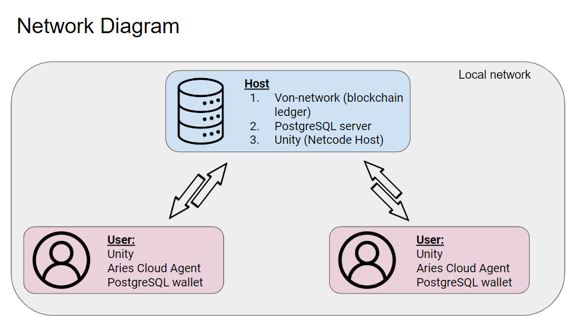

# Avatar Project User Guide

last update: 11/12/2023
you may refer to the web version for the latest version here: [https://quill-carriage-fc8.notion.site/Avatar-Project-User-Guide-e447ae230f014a388db5f3e380e92dc8?pvs=4](https://www.notion.so/Avatar-Project-Documentation-Landing-Page-a874edfbfab340b4a88817786147023a?pvs=21)

### Introduction to Avatar Project

Avatar Project is a proof of concept project that aims to build a virtual reality simulation environment. Different technologies are implemented and tested on their compatibility and performance. The following technologies implemented are Netcode for multiplayer support, PostgreSQL server as a local online database for persistence of player data, and Hyperledger Indy as a secondary blockchain database for security. 

### Features

1. **Multiplayer support**
    1. Players can host their own server and allow other players to join to interact in the virtual world 
    2. Online chat system
    
2. **Blockchain encrypted messaging system**
    1. Players can communicate with each other through encrypted messages over the blockchain ledger for security
    
3. **Digital asset credentials and ownership**
    1. Players can ensure that their digital assets are protected from other players who do not have the rights or credentials to access certain features or items in the virtual world 
    

## Installation Guide

This project requires multiple applications to be installed in order for the project to run smoothly. 

The applications required are as follows

1. Unity 2022.1.20f1
2. .NET framework to support C#
3. Git
4. Docker Desktop
5. Von-network 
6. Aries Cloud Agent
7. Python 3 
8. Ubuntu
9. PGAdmin4

Note: As a user, PGadmin4 is used to access the local Aca-py wallet. As a host, PGAdmin4 is also used to access the PostgreSQL server database.



It is **recommended to have PostgreSQL uninstalled** if it is installed on your current machine. This prevents potential port conflicts. The PostgreSQL instance runs on a Docker container. The local Aca-py wallet is hosted on port **5432**, while if you are the host, the server PostgreSQL database is hosted on port **5433**. 

## Step-by-step Instructions

### Part 1: Installing General Framework:

1. Install Unity Hub and Unity 2022.1.20f1
    1. The Unity Player configuration is as follows:
    
    
    
2. Install .NET framework and C# 
3. Clone the project from this repository into your local folder
4. Install Git

### Part 2: Installing Framework for Blockchain authentication

1. Install Docker Desktop
    1. In Settings > General > Use Docker Compose V2 
        
        Uncheck “Use Docker Compose V2”
        
2. Install [Von-network](https://github.com/bcgov/von-network)  and ensure Docker is running
    1. Install Python and pip (recommend to use a virtual environment such as virtualenv)
    2. Download this repository on **git bash**
        
        ```python
        git clone https://github.com/bcgov/von-network
        cd von-network
        ```
        
    3. Ensure that Docker is started
    4. If there is an issue running the docker container of aca-py or von-network you may try the following fix:
        1. In C:\Users\[username]\.docker **config.json** change **credsStore** to **credStore**
    5. Start the Von-network on [localhost:9000](http://localhost:9000) on **git bash**
        
        ```python
        cd von-network
        ./manage build
        ./manage start --logs
        ```
        
        
        
        
        
3. Install Aries cloud agent
    
    ```python
    git clone https://github.com/hyperledger/aries-cloudagent-python
    $ cd aries-cloudagent-python
    $ pip3 install -r requirements.txt -r requirements.dev.txt -r requirements.indy.txt
    $ pip3 install --no-cache-dir -e .
    ```
    
4. Install Libindy in a Ubuntu terminal
    
    ```python
    $ sudo apt-key adv --keyserver keyserver.ubuntu.com --recv-keys 68DB5E88
    $ sudo add-apt-repository "deb https://repo.sovrin.org/sdk/deb bionic master"
    $ sudo nano /etc/apt/sources.list [set deb [trusted=yes]]
    $ sudo apt install ca-certificates
    $ sudo apt-get update
    $ sudo apt-get install -y libindy
    ```
    

## Start-up guide

Before starting, you can view the video demos to see how it should be run. You can refer to video 1 for this section. There are also other videos that demonstrate the different in-game features and how to make use of the features.

### 1. Setting up von-network

After cloning and building Von-network and Aca-py, this is what the Docker should look like:


**If you are the host**, run Von-network. This can be done by clicking the play button in the von container in docker desktop, or use the command in git bash.

```jsx
./manage start
```

 in Git Bash in the root folder of von-network repository. This is what you should see after starting the Von-network successfully.


Now you can start the Unity project! Run from the splash screen or login screen if you are not using the executable 

### 2. Setting up PostgreSQL host server


From the login screen, the refresh button on the top left is red. This means that is not connected to the PostgreSQL Server. This could mean either one of two things:
1.  The host server IP address is wrong
2. The there is no host server initialized

If case 1: change the “Host Server IP Address” and press the red refresh button
If case 2: press the Database button to initialize the PostgreSQL server (this means you are the host)


**On the first run, it will take a while as Docker will download all the necessary containers.** 


Now, PostgreSQL server container should have been started, and you can verify it by looking at the Docker Desktop. This is also signified by the power button being green. 


Green means that the PostgreSQL server is now connected 

### 3. Creating a credential for a new user (should only be done by admin or existing user)


As an admin, key in your host IP address (the ip address that is hosting the sql server), username and password. 

**Do not press login, instead press the key button below the green power button.**


If Successful, your user name will appear in the top left corner of the Issue Credentials screen:


To issue the credential, fill in the identity number (maybe IC number of the user) and the expiry date of the credential in the DDMMYYYY format (no spaces/dash/etc). You can leave the receiver name empty. Ensure type is set to “account”. 

Click **generate** and take note of the credential ID that has been created:


**Von-network: Credential will be written to the blockchain ledger** 


**PostgreSQL Server: Issued credentials are also saved onto a table in the “AvatarProject” database:**


### 4. Creating a new account using a credential (done by user)

Go to the registration screen by pressing the “No Account? Click me to create one” button

Fill in the correct IP host address, credential code that was generated above by the admin, fill in the unique identity code, your preferred username and password. 

**Note**: Credential ID must fulfil: the 2 following requirements to be valid (other than the credential code being a valid one)

1. Identity Code must match the one used to create the credential in step 3 (hence why the Identity Code should be secret and unique(hence the IC number is the best fit))
2. the current date must be before or the same as the expiry date in step 3

Otherwise: the credential verification will fail:


Once pressing register, there will be a success pop up message.

**Von-network: new username will be written to the blockchain ledger:**


**SQL Server: user details (hashed) are also saved onto a table in the “AvatarProject” database:**


New users can now then log into the game with their newly created accounts


**Note:** The login first checks if the username is valid by checking with the blockchain ledger if such a username exists. If it is, a query is made to the SQL Server to see if the password matches the username. 

### 5. In-game SQL Server features


PostgreSQL Server is currently used to save the players inventory items and player location.

Note: SQLite is also used currently as a form of local database/ back-up of the SQL Server. It was implemented in case the project was run offline with no host. Hence whenever CRUD operations are made to the SQL Server, the same changes are also made to the SQLite database. However, the reverse is not true.

### 6. Establishing secure connections

Secure connections can be made between different users. Establishing a connection is important as it serves as a secure means for communicating securely with user others for subsequent features. This is done through doing a Diffie Hellman Key exchange between users, this creates a symmetric private key that the 2 users will have. This key will be used for encrypting data that will be communicated over the blockchain ledger. 


Click the “Messaging button” which will redirect you to the Messaging page. From there, click the “connections” button


Key in the username of the user you want to establish a connection with and click “invite”. A successful invitation will create a pop-up message as follows:


The receiver user will see that they have a new request. If they want to accept the invitation, they will key in the username of the inviter and press accept. There will also be a successful pop-up window. 


Lastly, the inviter will see that the invitee has accepted the invitation. 


The inviter will now complete the process by establishing the connection with the establish button. 

After doing so, both inviter and invitee will have a symmetric key stored on their Aca-py wallet. This key is used for both the credential issuance feature and the messaging feature. 

### 7. Credential Issuance

Credentials can be requested to the admin and then generated by admin to give users the credentials to access certain items and features in the virtual world. Currently, the two features that require credentials are driving the car and getting/throwing dynamite. If a user does not have the credentials, they are unable to pick the dynamite or drive the car. 


To get a credential, it has to be requested from the admin. This request can be made on the admin panel. The requester will have to input their identity number and expiry date (does not impact credentials as of now) Ensure that the type is set to the digital asset the requester wants access to. Click the request button. 


The admin will receive this request on the same panel of his account. To meet the request and generate the credential, the admin will have to input the requesters name, ID and expiry date (not used in current implementation) Ensure the type is set to the type requested for and press generate. It will take about 5 seconds to generate the credential. 


Next, the requester can refresh the credentials they received by inputting their userID and pressing the refresh button on the page. 


Now in the virtual world, they will be able to access the digital asset (car in this example). 


### 8. Encrypted Messaging feature

This messaging feature makes use of AES to encrypt messages between users with already established connections using the symmetric key. The UI shows how messages are automatically decrypted and shown on the UI. 


### 9. NFT token feature (prototype)

The goal of this feature is to explore an alternative method of credentials and tokens. This features follows how a NFT works (Non-Fungible Token). Each token is unique and there can only be one token per game object network ID. The token can be transferred from player to player. The token can only be minted by the admin. In the current implementation, the token ID is the network ID of the game object. Since the project currently uses Netcode which is outdated, an in place ID is used. This ID is manually assigned for now, and in the future, the network ID of the game object can be used instead. 


The NFT UI can be accessed from the main login page with the NFT button on the left. 

The “All Tokens” column shows all tokens that have been minted by the admin. Token data include the toeknID, a description of the token, and the username hash of the existing owner of the token. The “My Tokens” column shows the tokens that are currently owned. These tokens are NOT stored in the user’s wallet for now. 

Currently, users are only able to transfer tokens to other users, this is done by inputting the TokenID under NetworkID and the receiver name, then clicking “Transfer”.


For the Admin, an additional mint function is available. This function creates tokens using the networkID and the description. 

Minting and transferring transactions are all written to the ledger as schemas. 

## Host-Client set up

As earlier explained, the Host will have on its Docker:

1. Von-network (Hyperledger Indy)
2. PostgreSQL
3. Aries Agent

The Client will have on its Docker:

1. Aries Agent

Ensure that both machines are connected to the same local network and do not have PSQL already installed on the computer as there might be port conflicts

Also ensure that your network privacy settings on both the host and client machines allow for external connections from machines on the same local network. Also ensure that the firewall allows for external connections.

### Set-up process:

On the Host: 

1. Clone Von-network
2. build it using:

```bash
./manage build
```

1. Run it using: 

```bash
./manage run <yourIPv4Address> WEB_SERVER_HOST_PORT=9000
```

1. Modify the docker-compose.yaml file in Avatar\Assets\Main Scene Folder\Scripts\Wallet 
    
    `GENESIS_URL: "[http://host.docker.internal:9000/genesis](http://host.docker.internal:9000/genesis)"` should be changed to `“http://<yourHostIPv4Address>:9000/genesis”` for lines 24, 44 and 94
    

A demo is available on the shared video folder in Google Drive

## Video demonstration of individual features

Videos can be found on the Google Drive folder “Demo Videos”

### Video 1: initial set up

Case 1: User

Users only need the Unity project repository, Docker, Aca-py and Hyperledger Indy 

Case 2: Host

Host will additionally need Von-network as the blockchain network host

**Video description:**

Upon starting the app, ensure that Von network is built and started in the Git terminal. Next, launch the unity project. As a host, you can click on the DB button that will automatically build a PostgreSQL container in the docker. This PostgreSQL instance will be used as the main DB for the unity project that users will connect to. 

Since there are no existing registered users in the project, you can create a new user by clicking on the “Register” button. Use the credential code “genesis” to bypass any credential check process and to create the “admin” account. 

This is especially important that the user is “admin” as this account represents a trusted user that the server trusts and will rely on the admin account as an issuer of different tokens and keys. 

Upon logging in, the admin instance of the Aca-py agent will be loaded on docker. It comes with a built in PostgreSQL container instance that will be used to store not only admin keys, but also keys of other users who are registered on this machine. 

Once registered and logged in, you can see that the account registration and log in will be posted to the Von-network ledger.

It is important to log into the game and run the game after each creation of account as this will run code that configures the local Aca-py wallet of the player. 

### Video 2 : invitation of new player through creating access token

In order to allow someone to create an account,  (other than using the genesis bypass), the new user will need an invitation token. This invitation token can only be created by an existing user. This is to ensure unknown entities can create accounts and write to ledger or access the material in the VR world. Do note that each access token is single use and once activated, it cannot be reused (unless modified by admin/host by editing the main DB sql server)

To create an access token, 2 fields are required:

1. Identity number 
2. Expiry date

Important to note that the Identity number needs to satisfy a few requirements

1. Unique
2. Secret code known by both user and admin

The user's NRIC number/passport number is a suitable example of what the identity number can be

This ensures that users can verify themselves without sharing any codes with the admin over the blockchain network

**Video description:**

Upon keying in the username and password, press the “key” button that opens up the admin panel. Enter the invitees ID number and expiry date in the DDMMYYYY format. The access token will expire after this set date. Upon generating the token, the pop up screen will show the invitation number. This number should be communicated to the invitee for him to register his account. The invitation number is also written to the ledger, and embedded is also the hashed users ID. This invitation data is also saved to the main PostgreSQL db. 

The new user can now create his account on the registration page using his ID number and the invitation code.

Once again, it is important to note that new users should launch the game as this will configure their Aca-py wallet. 

### Video 3: establishing a connection between 2 users

Establishing a connection between 2 users (admin included) is a necessary step before further inter-agent communication can be done. The establishment process between user A and user B is a 3 part process. Note that user A knows user B’s username and vice versa.

This process is done using the Diffie Hellman (DH) Key exchange over the Von-network. The private key generated from the DH exchange will be the secret AES connection key between A and B.

**Video description:**

Step 1: A invites B to create a connection with him. This is done by creating DH parameters, A’s private and public key. Upon posting the invitation request, the DH parameters and A’s public key is posted to the ledger. A’s private key is stored in his personal Aca-py wallet. A’s messaging panel will show he has a pending invitation with B.

Step 2: when B opens the connections panel, it shows that he has invitation from A. If he wants to accept it, B will key in A’s username and click the accept button. This will get A’s public ley and the DH parameters. B will then generate his own public and private key. Similarly, B’s public key is posted on the ledger and the private key is stored on B’s local Aca-py wallet. B will then calculate a secret key (the generated AES key) by using the DH parameters, A’s public key and his own private key. This generated key is then stored on B’s local Aca-py wallet as the secret common AES key between A and B.

Step 3: when A opens the connections panel, he will see that B has accepted the invitation. A will now fully establish the connection by taking B’s public key, the DH parameters and his private key to calculate the secret key. This key calculated is the same as B in step 2. This key is then stored in A’s private Aca-py wallet.

This process allows A and B to communicate and create a secret symmetric key through asymmetric DH key exchange on a public ledger.

### Video 4: encrypted messaging feature between 2 users

**Video description:** 

After creating a connection, A and B can send encrypted messages to each other using the AES key generated in video 3. Message bytes will be encrypted using the AES key, and the AES initialisation vector will be shared to the public ledger. B can then read the encrypted message as the encrypted message bytes can be decrypted since the AES IV is shared, and B has the same symmetric AES key that was used by A to encrypt the message. 

This is the first feature that uses the AES key.

### Video 5: credential request and issuance

Credentials in the virtual world help to provide a sense of license or ownership. This ensures that digital assets can be controlled only by certain entities, or certain features can only be used by those who have the necessary credentials to access. This is the first of 2 videos to show the credential process.

The process takes 3 steps:

1. User wants to gain access to the car (for example). The user will go to the admin panel to request for the car credentials by entering his Identification number. He will then send the request. This request is in the form of a scheme that will be posted to the ledger. 
2. Admin will receive the request. After seeing the username, the admin decides if user has the credential/liscence to get access to the car. If deemed so, admin will issue the credential to user by keying in user’s identity number (common secret) and verify the request by posting a credential definition to the ledger. A secret key for the user to access the car will be generated from the credential definition values and the secret symmetric AES key both admin and user have. This key will be added to the main database of the game

### Video 6: shows the user accepting the credential offer from admin.

This last step completes the credential issuance process. User will receive the offer and accept the offer by clicking the refresh number along with his identity number. This will get the credential definition from the ledger and generate the access credential token with the use of the symmetric AES key.

### Videos 7,8,9: Example videos showing the credential feature on digital assets

